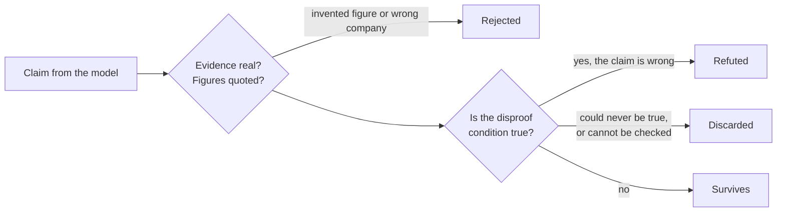

# How Sealed Window Picks Stocks

*A plain-language guide*

A research system that reads Indian stock-market data, asks an AI model to argue about it, then
throws away every argument that the numbers contradict. It recommends; it cannot trade.

| | |
|---|---|
| **Market** | NSE equities (Nifty 500) |
| **Data** | Upstox, read-only |
| **Models** | Claude Sonnet 5 & Haiku 4.5, or a model served on your own machine |
| **Last run** | 16 Sep 2026 · 10 picks · $1.68 |

---

## 01 · The problem this design is built around

An AI model asked "is this a good stock?" will always answer. It will sound confident, cite numbers
that may or may not be real, and give you no way to tell a solid argument from a plausible-sounding
one. Worse, the model reads news articles — and a news article is text written by a stranger, which
may be trying to manipulate whoever reads it.

So this system never asks a model for a verdict. It asks for **claims that can be proven wrong**,
then checks each one against the data by machine. The model's job is to notice things worth arguing
about. The machine's job is to kill the arguments that don't hold.

> Three rules shape everything: the model never touches the internet, every claim must come with the
> condition that would disprove it, and the entire bill is agreed before the first question is asked.

---

## 02 · Rule one: the model works offline

Market data is downloaded first, saved to disk, and locked. Only then does any AI model start work —
and by that point the program has no route to the market data provider at all. The two never overlap.

| Phase | 1 Collect | 2 Filter | 3 Claim | 4 Check | 5 Attack | 6 Publish |
|---|---|---|---|---|---|---|
| **Market data** | **connected** | closed | closed | closed | closed | closed |
| **AI model** | idle | idle | **thinking** | idle | **auditor** | idle |

This holds whichever model you use. With Claude, the one address reachable while a model runs is the
Anthropic API; with a local model it is 127.0.0.1. Neither window can be opened while the market-data
connection is live, and the market-data connection cannot be reopened once closed.

The connection to the market data provider is open only while collecting. From then on the analysis
runs against a frozen copy, so nothing a model does can reach back out to the market, and nothing can
change under it mid-analysis.

Why it matters: if a news article inside the data tried to trick the model into leaking something or
fetching something, there is nowhere to send it and nothing to fetch. The worst it can achieve is a
false claim, and false claims are what the next rule is for.

### What the system is allowed to touch

The download step may call exactly **seven** addresses at the data provider, all read-only: the list
of listed companies, daily prices, today's price, three financial-statement endpoints, and company
news. Everything else — orders, holdings, account balance, trading history — is absent from the code.
Not blocked by a setting; simply never written.

> **A real trap this caught.** The provider recently allowed the same read-only key to reach account
> data such as holdings and positions. The news endpoint also accepts a setting that returns "news
> about your portfolio". Both are refused here, because the permitted web addresses and their
> settings are pinned in a list the code checks before every request, and the test suite tries every
> forbidden one to prove it fails.

---

## 03 · Rule two: every claim carries its own disproof

This is the heart of the design, and it is simpler than it sounds. When the model says something, it
must also say what would make that statement false — written as a short formula the computer can
evaluate against the saved data.

> *fundamental · supports owning · confidence 0.85 · HBL Engineering*
>
> "ROCE stands at 47.79% versus a sector benchmark of 14.99%, and ROE is 36.8% versus sector 13.06%,
> indicating exceptional capital efficiency relative to peers."
>
> wrong if: `roce_pct < sector_roce_pct + 5` → 47.79 is not below 19.99 → **kept**

The computer reads the formula, plugs in the saved numbers, and gets a straight yes or no. "The
condition came true" means the claim is wrong, and it is deleted — not softened, not down-weighted.
Nothing about the model's tone or confidence can save it.

### Four ways a claim dies

Every claim runs this gauntlet before it can count toward a recommendation. In the 16 September run,
289 claims went in and 243 came out.

| Outcome | What happened | Real example |
|---|---|---|
| **Refuted** | The disproof condition turned out to be true. | A claim that leverage was falling, where the figure had risen. |
| **Rejected** | It cited evidence about a different company, or quoted a figure that appears nowhere in the data. | 41 claims, mostly news claims citing only price evidence. |
| **Unusable** | The figure needed is missing, or older than the freshness limit — 5 days for prices, 400 days for financial statements. | Stocks whose last published accounts date from 2010. |
| **Unkillable** | The condition could never be true for *any* company in the market, so the claim could never fail. Discarded. | "ROE 45.69% beats the sector's −2.52%", disproved only if ROE fell below −2.52%, which no company in the index reaches. |

That last one deserves attention. It is the loophole an AI would find on its own — write a test you
can't fail — and the check for it compares the threshold against the spread of every company in the
index.

That check **had** a known limit, found by running the system against a local model and since closed.
It asked *"could this condition fire for some company?"* — not *"could it fire for **this**
company?"* A test like `rsi_14 > 34.661507`, written for a company whose RSI is exactly 34.661507,
passed the check (plenty of companies sit above that level) while being impossible to fail for the
one company it describes. In one run, **12 of 26 surviving claims** did exactly this.

The adjudicator now discards a threshold copied from the subject's own row: a strict comparison
whose number matches that company's measured value to more than two decimal places is a tautology,
not a test. Replaying that run through the fixed check kills exactly those 12 and leaves the other
14 standing — including `news_count_7d > 0` against a count of zero, which is zero-margin but
entirely legitimate, because zero is a natural boundary rather than a reading copied off the page.
Precision, not margin, is what separates the two.

### Worked examples: how a claim lives or dies

The rule, stated once:

> **The falsifier is the condition that would make the statement false.** If that condition turns
> out to be true, the claim dies. If it is false, the claim lives. "The falsifier fired" is bad news
> for the claim.

That reads backwards to most people, so here are five real cases from actual runs.

**1 · A correct claim that survives**

| | |
|---|---|
| Statement | "ROCE is comfortably above the sector benchmark" |
| Falsifier | `roce_pct < sector_roce_pct` |
| Actual values | roce_pct = **67.99**, sector_roce_pct = **19.68** |
| The machine asks | is 67.99 < 19.68? → **No** |
| Verdict | **survived** |

Read the falsifier aloud: *"I would be wrong if ROCE were below the sector."* It isn't, so the claim
stands. This is what a well-formed claim looks like.

**2 · A wrong claim, correctly refuted**

| | |
|---|---|
| Statement | "The company is old for its fundamentals, with a history dating back to before 2024" |
| Falsifier | `fundamentals_age_days < 2024` |
| Actual value | fundamentals_age_days = **79** |
| The machine asks | is 79 < 2024? → **Yes** |
| Verdict | **refuted** |

The model read a column counted in *days* as though it were a *year*. The claim is nonsense, its own
test fires, and it is deleted. Nothing was special-cased to catch this — the arithmetic did it.

**3 · The direction trap, first form: a true claim killed**

| | |
|---|---|
| Statement | "The earnings yield (1/pe) is less than the sector benchmark" |
| Falsifier | `pe > sector_pe` |
| Actual values | pe = **34.38**, sector_pe = **20.58** |
| The machine asks | is 34.38 > 20.58? → **Yes** |
| Verdict | **refuted** |

But look: earnings yield is 1/pe, so 1/34.38 = 0.029 against the sector's 1/20.58 = 0.049. The
statement was **true**. It was destroyed because the falsifier restated the claim instead of negating
it. Written correctly as `pe <= sector_pe` — *"I'd be wrong if P/E were at or below sector"* — it
would have survived.

**4 · The direction trap, second form: a false claim kept**

| | |
|---|---|
| Statement | "The operating margin has **improved** in the last year" |
| Falsifier | `operating_margin_delta_1y_pp >= 0` |
| Actual value | **−1.621612** — the margin *declined* |
| The machine asks | is −1.62 ≥ 0? → **No** |
| Verdict | **survived**, at confidence 0.95 |

This is the serious one. The statement is false, and it survived — because the falsifier only fires
when the claim is *true*. Written correctly as `operating_margin_delta_1y_pp <= 0`: is −1.62 ≤ 0?
Yes → fires → refuted, which is the right answer.

**5 · A test that cannot fail**

| | |
|---|---|
| Statement | "The stock is in a bearish state as per the RSI indicator" |
| Falsifier | `rsi_14 > 34.661507` |
| Actual value | rsi_14 = **34.661507** — exactly the threshold |
| The machine asks | is 34.661507 > 34.661507? → **No**, by exactly zero |
| Verdict | **survived** — but it could never have done anything else |

The model set its own passing grade at precisely the mark it had already achieved.

### The test you can apply yourself

For any claim, ask one question: **if this falsifier were true, would the sentence be wrong?**

| Statement | Falsifier | If it fires, is the sentence wrong? | |
|---|---|---|---|
| ROCE above sector | `roce_pct < sector_roce_pct` | Yes — ROCE below sector | ✅ |
| P/B above sector | `pb > sector_pb` | No — that is the claim restated | ❌ |
| Margin improved | `operating_margin_delta_1y_pp >= 0` | No — that *is* improvement | ❌ |
| Margin improved | `operating_margin_delta_1y_pp <= 0` | Yes — that is decline | ✅ |

If the answer is "no", the falsifier points the wrong way — and the system will publish the claim
anyway. **There is no machine check for this.** The predicate is well-formed, evaluable and
reachable; only the relationship between the sentence and its test is broken, and nothing in the
pipeline verifies that relationship. It is the single largest gap in the method, and it is why every
claim is printed beside its test: so a reader can apply the question above.

---

## 04 · The six steps, in order

### 01 · Collect and freeze
`market data: connected` · `model: idle`

For each of the ~500 companies: ten years of daily prices, six headline ratios, the last four years
and four quarters of results, the balance sheet, and recent news. That is about 3,000 requests, paced
to stay inside the provider's limits, and takes roughly 40 minutes.

The result is written once, made read-only, and fingerprinted. Any later change to a single digit
makes the fingerprint fail, and the analysis refuses to run. Every individual fact gets its own
reference number like `ev:349d5c0c29b42bbb`, which is the only way anything later is allowed to
refer to it.

### 02 · Filter down to a shortlist
`market data: closed` · `model: idle`

Plain arithmetic, no AI: from ~500 companies down to about 170 that meet your thresholds, then the
top 20 by return on capital. These are the sliders you set — profitability, growth, valuation, price
behaviour — and they are compared against the saved numbers directly.

Two deliberate refusals here: a company missing a required number is *rejected*, never given the
benefit of the doubt; and a company whose accounts are too old to trust is rejected even if every
other number looks perfect.

### 03 · Ask for arguments
`market data: closed` · `model: thinking`

Each of the 20 companies gets three separate questions, asked independently, each seeing only its own
slice of data: one about the business (Claude Sonnet 5), one about the price chart (Sonnet 5), one
about the news (the cheaper Haiku 4.5). Each returns at most six claims, each with evidence
references, a confidence between 0.05 and 0.95, and its disproof condition.

Before committing, an analyst may ask for more of the frozen data — deeper price history, the full
statement tables, how the company ranks against its peers, or further news pages. These four probes
(`price_history`, `statement_detail`, `peer_comparison`, `news_articles`) read the sealed copy on
disk, so curiosity costs tokens but opens no network. Each analyst is bound to one company and draws
on a prepaid pool of probes, and every probe is recorded.

What the models still cannot do: reach the internet, read your files, run code, or call each other.
Peer comparison returns a rank and a percentile, never another company's identity. News text is
wrapped and labelled as data, with a note that nothing inside it is an instruction.

**Running it on your own machine.** The same six phases can be driven by a local model instead of
Claude — llama3.2 or qwen3, served on the loopback interface. A local run commits **$0.00** and the
plan names the model it will actually call. The seal narrows rather than widens: during a local model
call the only reachable address is 127.0.0.1, so an injected instruction still has nowhere to send
anything. It is slower by a wide margin — on an Intel i9 with no GPU, generation runs at single-digit
tokens per second, making a 20-company run an overnight job — and a small local model produces
noticeably weaker claims than Sonnet. It exists so the method can be exercised without spending.

### 04 · Check every argument
`market data: closed` · `model: idle`

The gauntlet from the previous section, run by plain code. Survivors are then scored by simple
addition: each surviving claim contributes its confidence, positive claims adding and negative claims
subtracting, weighted by subject — business 1.0, price chart 0.8, news 0.5.

News counts least on purpose: it is the one input written by strangers.

### 05 · Let an auditor attack
`market data: closed` · `model: thinking`

A second model sees the surviving claims and the underlying evidence — but not the reasoning that
produced them, so it cannot be led. It has exactly one power: to argue that a claim is wrong. There
is no field in its answer for agreement, so "looks fine to me" is not an available response.

Its attacks face the same machine check. In the 16 September run it killed two claims, including one
arguing a stock's year-long gain proved an intact uptrend — refuted by pointing out the stock trades
below its 200-day average.

An attack must also *be* an attack. A refutation that reuses its target's own falsifier is rejected
outright: the claim survived precisely because that condition is false, so an identical condition in
the refutation is false too, and the attack would "stand" without ever asserting anything — deleting
a claim the auditor actually agreed with. That is worse than an auditor who finds nothing, because
it destroys correct claims, and no later check can catch it: the predicate is well formed, evaluable
and reachable. A weak local model produced exactly this, with **6 of 14 refutations** restating the
claim they were attacking; the other 8 negated their target properly, fired, and destroyed
themselves harmlessly.

### 06 · Publish what survived
`market data: closed` · `model: idle`

No model writes the report. It is assembled from surviving claims, so every sentence traces to a
claim, every claim to a fact, and every fact to a row in the frozen data. The disproof conditions
stay attached, so you can see what would make each argument wrong.

---

## 05 · The measurements, in plain words

Every number the models reason about is computed in step 1 by ordinary arithmetic, never by the AI —
because a model asked to compute an average will produce a plausible one.

### From the price chart

| Measure | What it is | What it suggests |
|---|---|---|
| **Moving average** `20 / 50 / 200 days` | The average closing price over the last 20, 50 or 200 trading days. | A price above its 200-day average is in a long uptrend; below it, a long downtrend. The short averages show the recent mood. |
| **RSI** `14 days` | A 0–100 gauge comparing the size of recent gains with recent losses. | Above 70, the stock has risen hard and fast and may be stretched. Below 30, it has fallen hard. Around 50 is balanced. |
| **MACD** | The gap between a fast and a slow moving average, plus a smoothed version of that gap. | When the gap is widening upward, momentum is building; when it shrinks or turns negative, momentum is fading. |
| **ATR** `14 days` | The typical daily trading range, shown as a percentage of the price. | How jumpy the stock is. 2% is calm; 6% means large daily swings, and a wider gap between a good day and a bad one. |
| **Volume ratio** | Recent 5-day average trading volume divided by the 20-day average. | Above 1, more people are trading than usual, which lends weight to a price move. Below 1, a move is happening on thin participation. |
| **Returns and drawdown** | Price change over 5, 30, 90 and 250 days, and the distance below the highest price of the past year. | Straightforward performance, and how far the stock sits below its best recent level. |

### From the accounts

| Measure | What it is | What it suggests |
|---|---|---|
| **ROE** | Profit as a percentage of shareholders' money in the business. | How well the company turns owners' capital into profit. Compared against its sector, never in isolation. |
| **ROCE** | Profit as a percentage of all capital used, including borrowings. | Similar, but not flattered by heavy borrowing. High and sustained is the mark of a strong business. |
| **P/E and P/B** | Price relative to annual profit, and relative to book value. | What you pay for each rupee of profit or assets. High means the market expects growth; if growth disappoints, the fall is further. |
| **Revenue and profit growth** | Change against the previous financial year. | Whether the business is expanding, and whether profit is growing faster than sales. |
| **Operating margin** | Operating profit as a percentage of revenue, and its change year on year. | Profit kept per rupee of sales, and whether that is improving. |
| **Leverage** | Total liabilities divided by equity. | How much of the business is funded by others' money. Higher means higher risk when trading turns down. |
| **Bank measures** `NIM · Net NPA · CASA` | Lending margin, bad loans as a share of lending, and the share of cheap deposits. | Banks are judged on these because ROCE and leverage are meaningless for them — a bank's balance sheet is *supposed* to be mostly other people's money. |

> **An honest gap.** The data provider supplies today's ratios with no date attached, and returns
> roughly a week of news rather than a month. So the fundamentals are current-but-undated, and news
> coverage is thin — 364 of 498 companies had no headlines at all in the latest run. Both facts are
> printed on every report rather than smoothed over.

---

## 06 · How the top five actually emerge

Walking through the run of 16 September 2026, with the real figures.

| 498 | → | 20 | → | 289 | → | 243 | → | 10 |
|---|---|---|---|---|---|---|---|---|
| companies | | passed the filter | | claims made | | survived checking | | published |

Each company's score is the weighted sum of its surviving claims. HBL Engineering finished top with a
score of 2.60, built from four surviving business claims and three price claims, against one business
and two price claims arguing the other way:

> *business · supports · 0.80*
>
> "Revenue grew 68.66% and net profit grew 205.61% year on year, reflecting a sharp acceleration in
> the business."
>
> wrong if: `revenue_growth_1y_pct < 30 OR net_profit_growth_1y_pct < 100` → **kept**

> *price chart · argues against · 0.75*
>
> "Despite the recent bounce, the stock remains 5.64% below its 200-day average and is down 34.46%
> from its 52-week high, indicating the longer-term trend is still impaired."
>
> wrong if: `price_vs_sma200_pct >= 0 AND drawdown_from_52w_high_pct >= -10` → **kept**

Both survived, so both count — the second subtracting from the first. That is deliberate: a
recommendation built only from supporting arguments is advertising.

### The label each company gets

| Label | Rule |
|---|---|
| **Buy** | Score of 1.0 or more, supporting claims in at least two different subjects including the business, and no surviving business argument against it with confidence 0.6 or higher. |
| **Watch** | Evidence survived, but not enough of it, or a serious counter-argument stands. The 16 September run produced ten of these and no buys. |
| **Avoid** | Score of −0.5 or below: the surviving evidence points the other way. Seven companies landed here, including two large IT firms. |
| **Nothing at all** | No surviving claims means the company is not published. If fewer than five make the list, the report says so and stays short — there is no code that can pad it. |

The list is capped at ten. If only three companies earn a place, you get three, and a line explaining
why.

---

## 07 · Rule three: the bill is agreed in advance

Before a single question is asked, the system prints exactly what the run will cost — derived from
the number of companies, the models chosen, and a hard cap on the length of every question and
answer. You approve that number, not a budget ceiling.

| Work | Model | Calls | Committed | Local |
|---|---|---:|---:|---:|
| Business analysis | Claude Sonnet 5 | 20 | $1.76 | $0.00 |
| Price-chart analysis | Claude Sonnet 5 | 20 | $1.40 | $0.00 |
| News analysis | Claude Haiku 4.5 | 20 | $0.55 | $0.00 |
| Probes | Claude Haiku 4.5 | 40 | $0.78 | $0.00 |
| The auditor | Claude Sonnet 5 | 5 | $1.20 | $0.00 |
| **Maximum possible** | — | **105** | **$5.69** | **$0.00** |

The two columns are the same run: identical call counts and identical token limits, priced against
Claude or against a model on your own machine. A local run is not a smaller run, only a free one.

Because the mode changes which models the plan names, it changes the plan's fingerprint too — so an
approval issued for a Claude run cannot start a local one, or the reverse. The last full Claude run,
before probes existed, committed $3.69 across 65 calls and spent $1.68.

Each question must claim a pre-paid slot from that plan; there is no way to send a question without
one, and the counter only goes down. A question longer than its allowance is refused rather than
trimmed, because a silently shortened question produces an answer about incomplete evidence.

---

## 08 · What this does not tell you

The most useful section, and the one most systems leave out.

> **The method has not been shown to work.** A walk-forward test — rebuilding the filter at past
> dates and measuring what followed — has now run over **35 windows of four years**, for all three
> ranking rules. None of them clears the bar, and all three report `promotion_ready: False`.

| Ranking rule | Precision (h20/k5) | Excess over 20 sessions | Worst drawdown |
|---|---:|---:|---:|
| momentum_90d | 0.446 | −0.02% | −36.2% |
| risk_adjusted_momentum | 0.474 | −0.39% | −29.7% |
| trend_quality | 0.411 | −0.59% | −40.8% |

Precision across every rule and horizon lands between **0.411 and 0.480** — a coin flip, where 0.5
would mean picking a better-than-average stock half the time. Over the following month the shortlist
essentially matches the basket it was drawn from, and sometimes trails it. Over three months there is
a positive excess of 1–3%, but it comes with drawdowns approaching 40%, which is why the drawdown
gate fails even where the return gate passes.

The test also flatters itself: it uses today's index membership, so companies that collapsed and fell
out of the index are missing entirely.

- **The AI's arguments have never been tested against outcomes.** The test above measures the
  arithmetic filter only. Whether the claim and veto layers add anything is unmeasured — which is
  the main reason the local-model mode exists, since answering it takes many runs.
- **A surviving claim is not a true claim.** It means the argument passed the test it set for itself.
  A weak test produces a weak survivor, which is why every test is printed beside its claim. And a
  test pointed the *wrong way* produces a false survivor that nothing can catch — see the worked
  examples in section 03, where a claim that the operating margin had improved survived at
  confidence 0.95 while the margin had in fact fallen by 1.62 points.
- **Prices are one moment.** The report carries the date of its data, and the date the prices
  actually end, which are not always the same — a market holiday leaves a gap.
- **Roughly one company in ten has unusable accounts** — stale by years, or simply absent. They are
  excluded, not estimated.
- **It cannot trade, and never will.** No order, portfolio or account function exists anywhere in the
  code. This is a research tool whose output a person reads and decides about.

Everything published carries three fingerprints: the data, the settings, and the spending plan. Given
those three, the same report can be reproduced exactly — which is what makes "why did it say that?" a
question with an answer.

---

*Sealed Window · plain-language guide · figures from the live run of 16 September 2026 · research
only — not investment advice*
